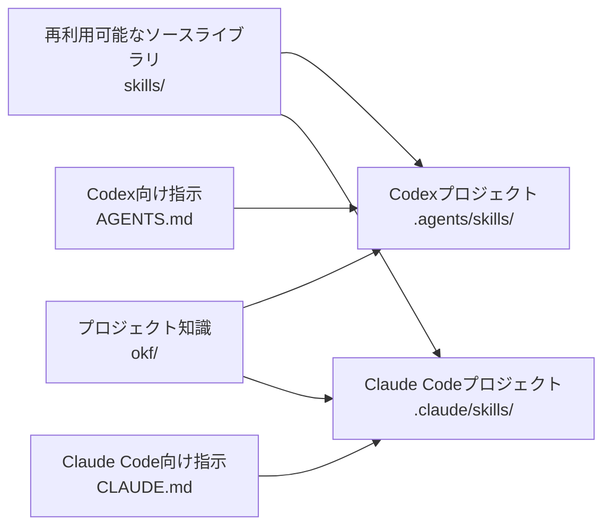

<h1 align="center">OKF Skills</h1>

<p align="center">
  <a href="https://github.com/hamakyo/okf-skills/actions/workflows/markdown.yml"></a>
  <a href="LICENSE"></a>
  <a href="https://github.com/hamakyo/okf-skills/releases/latest"></a>
</p>

<p align="center">
  <a href="README.md">English</a> | 日本語
</p>

Codex、Claude Code、その他のエージェント支援型ソフトウェア開発で再利用できる Skills と、OKF v0.2に基づくソフトウェアプロジェクト向けプロファイルです。

## このリポジトリが解決すること

AIコーディングエージェントは、プロジェクト固有の知識と明確な作業手順の両方を与えることで、より安定して動作します。しかし多くのリポジトリでは、それらが場当たり的なプロンプト、古くなったWiki、長大な指示文などに混在し、保守しづらくなりがちです。

このリポジトリは、小さく持ち運びやすいリファレンスプロファイルを提供します。

- 人間とエージェントの双方が読めるプロジェクト知識用のOKFテンプレート
- 機能実装、バグ調査、テスト、リファクタリング、OKF更新などの反復可能な開発ワークフロー用Skills
- Codex向けの `AGENTS.md`
- Claude Code向けの `CLAUDE.md`
- 自分のリポジトリへコピーして使える最小構成のサンプル

## 基本コンセプト

### OKF

OKF（Open Knowledge Format）は、プロジェクトの知識レイヤーです。このリポジトリはOKF v0.2を対象とし、アーキテクチャ、ドメイン、データ、機能、プレイブックを整理するためのソフトウェアプロジェクト向けプロファイルを追加します。これらのディレクトリ分類は、OKF本体の必須要件ではありません。

OKFが答える問いは、**「このプロジェクトについて何が正しいか？」** です。

### Skill

Skillは、エージェントが読める作業ワークフローです。各SkillはupstreamのAgent Skills形式に従います。さらに、このリポジトリの正本Skillには、利用条件、必要なコンテキスト、手順、ガードレール、完了チェックリストを揃える独自のauthoring profileを適用します。

Skillが答える問いは、**「この種類の作業をどう進めるか？」** です。

### AGENTS.md

`AGENTS.md` はCodex向けのリポジトリレベルの指示ファイルです。Codexに、このリポジトリの使い方、README/docs/OKFを読むタイミング、Skillsやドキュメントを同期して保つ方法などを伝えます。

### CLAUDE.md

`CLAUDE.md` はClaude Code向けの指示ファイルです。基本的なリポジトリルールは `AGENTS.md` と共通ですが、Claude Codeの利用を前提に記述しています。

## 全体像



## ディレクトリ構成

```text
.
├── README.md
├── README.ja.md
├── LICENSE
├── CONTRIBUTING.md
├── CHANGELOG.md
├── AGENTS.md
├── CLAUDE.md
├── docs/
│   ├── getting-started.md
│   ├── codex.md
│   ├── claude-code.md
│   ├── okf.md
│   ├── okf-software-project-profile.md
│   ├── customization.md
│   └── usage-matrix.md
├── examples/
│   ├── minimal/
│   │   ├── AGENTS.md
│   │   ├── CLAUDE.md
│   │   ├── okf/
│   │   └── skills/
│   ├── codex-project/
│   │   └── .agents/skills/
│   └── claude-code-project/
│       └── .claude/skills/
├── okf/
│   ├── index.md
│   ├── log.md
│   ├── architecture/
│   ├── domain/
│   ├── data/
│   ├── features/
│   └── playbooks/
└── skills/
    ├── implement-feature/
    ├── investigate-bug/
    ├── add-test/
    ├── refactor-safely/
    └── update-okf/
```

検証・同期ツールは `scripts/`、Skillのrouting fixtureは `evals/` に配置します。

## クイックスタート

1. 最小テンプレートを自分のプロジェクトへコピーします。

   ```sh
   cp -R examples/minimal/. /path/to/your-repo/
   ```

2. `/path/to/your-repo/okf/index.md` を編集し、自分のプロジェクトについて記述します。

3. 必要に応じて `okf/architecture/`、`okf/domain/`、`okf/data/`、`okf/features/`、`okf/playbooks/` にプロジェクト固有のOKFドキュメントを追加します。

4. CodexまたはClaude Codeに、該当するSkillを使って作業するよう依頼します。

   ```text
   Use the implement-feature skill to add user profile editing.
   Read OKF first and update OKF after the implementation if behavior changes.
   ```

より詳しい手順は [Getting Started](docs/getting-started.md) を参照してください。

## Codexで使う

Codexは、リポジトリレベルの指示として [AGENTS.md](AGENTS.md) を読みます。このリポジトリでは、トップレベルの `skills/` を再利用可能なSkillの正本として扱います。Codexプロジェクトで自動検出させる場合は、Skillを `.agents/skills/` 配下に配置します。

利用例：

```text
Use the implement-feature skill to add a CSV export button.
Read README.md, docs/codex.md, and relevant OKF files before editing.
```

Codexの自動検出レイアウトは `examples/codex-project/` を参照してください。

詳しくは [docs/codex.md](docs/codex.md) を参照してください。

## Claude Codeで使う

Claude Codeは、リポジトリレベルの指示として [CLAUDE.md](CLAUDE.md) を読みます。このリポジトリでは、トップレベルの `skills/` を再利用可能なSkillの正本として扱います。Claude Codeプロジェクトで自動検出させる場合は、Skillを `.claude/skills/` 配下に配置します。

利用例：

```text
Use the investigate-bug skill.
Reproduce the issue first, summarize likely causes, then propose the smallest fix.
```

Claude Codeの自動検出レイアウトは `examples/claude-code-project/` を参照してください。

詳しくは [docs/claude-code.md](docs/claude-code.md) を参照してください。

## Skill一覧

| Skill | 使う場面 | 使わない場面 |
| --- | --- | --- |
| [`implement-feature`](skills/implement-feature/SKILL.md) | 新機能の追加、または既存の挙動を変更するとき | 調査やトリアージだけを行うとき |
| [`investigate-bug`](skills/investigate-bug/SKILL.md) | 不具合、回帰、原因不明の失敗を調査するとき | 原因と修正内容がすでに明確なとき |
| [`add-test`](skills/add-test/SKILL.md) | 既存の挙動に対するテストを追加・改善するとき | 期待する挙動自体が未定義のとき |
| [`refactor-safely`](skills/refactor-safely/SKILL.md) | 挙動を変えずに内部構造を改善するとき | 公開API、スキーマ、製品挙動を変更する必要があるとき |
| [`update-okf`](skills/update-okf/SKILL.md) | 実装や設計変更後にOKFを更新するとき | ユーザー向け挙動、アーキテクチャ、ドメイン、データ、プレイブックに変更がないとき |

## OKFを書く

OKFには、タスクごとの指示ではなく、長く使えるプロジェクト知識を書きます。有用なOKFドキュメントには、通常次のような情報を含めます。

- 少なくとも `type` を持つYAML frontmatter
- 必要に応じた `title` と `description`
- 必要に応じた関連OKFドキュメントへのリンク
- エージェントが推測せずに済む具体的な情報
- 外部資料に基づく内容であれば、引用元やソースへのリンク
- 値が分かる場合に限った、v0.2のprovenance、trust、lifecycle metadata

例：

```md
---
type: Feature
title: CSV Export
description: Lets users export filtered table rows as a CSV file.
tags: [export, reporting]
---

# Behavior

The export includes the same rows currently visible after filters are applied.

# Related

- Reporting overview: `okf/domain/reporting.md`
```

upstreamのモデルは [OKF v0.2](docs/okf.md)、このリポジトリ独自の規約は [Software Project Profile](docs/okf-software-project-profile.md) を参照してください。

## 自分のリポジトリに追加する

1. `AGENTS.md`、`CLAUDE.md`、`okf/` を自分のリポジトリへコピーします。
2. 必要なSkillをトップレベルの `skills/` から、Codexなら `.agents/skills/`、Claude Codeなら `.claude/skills/` へコピーします。
3. `okf/index.md` を自分のプロジェクト向けに書き換えます。
4. OKFディレクトリ配下へプロジェクト固有の知識を追加します。
5. `AGENTS.md` と `CLAUDE.md` にテストコマンド、コーディング規約、リリースルールなどを追記します。
6. 再利用可能なSkillには汎用的な手順を残し、プロジェクト固有の事実はOKFに分離します。

## カスタマイズ例

- PRレビュー用の `review-pr` Skillを追加する
- 分析用テーブルやデータ契約を `okf/data/warehouse.md` に記録する
- リリース手順を `okf/playbooks/release.md` に追加する
- `refactor-safely` にプロジェクト固有の公開APIルールを追加する
- `AGENTS.md` と `CLAUDE.md` にテストコマンドを追加する

詳しくは [docs/customization.md](docs/customization.md) を参照してください。

## よくある利用パターン

- 機能開発を始める：`implement-feature` → `update-okf`
- 回帰バグを調べる：`investigate-bug` → 必要なら `add-test`
- テストカバレッジを改善する：対象ファイル、機能、バグを指定して `add-test`
- コードを整理する：`refactor-safely` を使い、差分を小さく保つ
- プロジェクト知識を更新する：意味のある実装変更後に `update-okf`

Codex、Claude Code、汎用テンプレートの比較は [docs/usage-matrix.md](docs/usage-matrix.md) を参照してください。

## コントリビューション

このリポジトリへの貢献は、再利用性、明確さ、正確さを高めるものであり、プロジェクト固有のプロンプト集にならないようにしてください。

Pull Requestを作成する前に：

- [CONTRIBUTING.md](CONTRIBUTING.md) を読む
- Skillsとドキュメントの内容を同期する
- README、`AGENTS.md`、`CLAUDE.md` からのリンクを確認する
- シークレット、認証情報、非公開URL、個人情報を含めない

決定的なリポジトリ検証を実行します。

```sh
python -m pip install -r requirements-dev.txt
python -m unittest discover -s tests
python scripts/validate_markdown.py
python scripts/validate_okf.py
python scripts/validate_skills.py
python scripts/sync_examples.py --check
```

## ライセンス

このプロジェクトは [MIT License](LICENSE) のもとで公開されています。

## 免責事項

このリポジトリは、コーディングエージェント向けのテンプレートと運用ガイドを提供するものです。正確性、セキュリティ、法令遵守、本番環境への適合性を保証するものではありません。生成された変更は必ずレビューし、組織やプロジェクトに合わせてテンプレートを調整し、適切な検証を行ってください。
