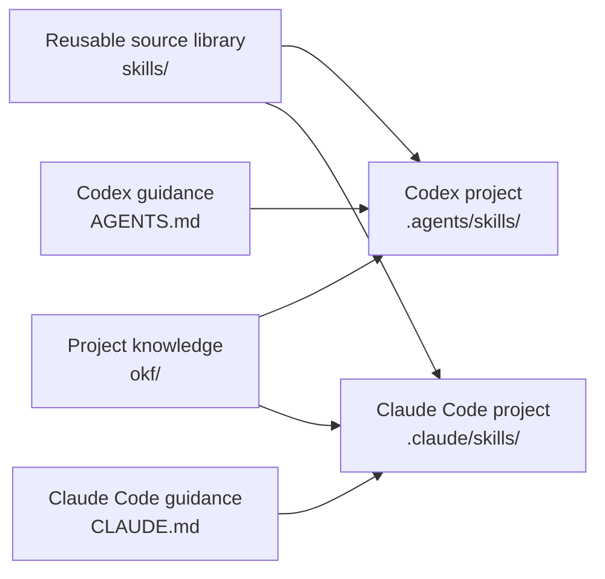

# OKF Skills

[](https://github.com/hamakyo/okf-skills/actions/workflows/markdown.yml)
[](LICENSE)
[](https://github.com/hamakyo/okf-skills/releases/latest)

Reusable Skills and Open Knowledge Format (OKF) templates for Codex, Claude Code, and agent-assisted software projects.

## What This Solves

Agent coding tools work best when they have both project knowledge and clear working procedures. Most repositories mix those concerns into ad hoc prompts, stale wiki pages, or long instructions that are hard to maintain.

This repository provides a small, portable starter kit:

- OKF templates for project knowledge that humans and agents can read.
- Skills for repeatable engineering workflows such as feature work, bug investigation, tests, refactoring, and OKF updates.
- `AGENTS.md` guidance for Codex.
- `CLAUDE.md` guidance for Claude Code.
- A minimal example you can copy into your own repository.

## Core Concepts

### OKF

OKF, or Open Knowledge Format, is the project knowledge layer. In this repo, OKF means a directory of Markdown files with lightweight YAML frontmatter where useful. It captures architecture, domain concepts, data structures, features, playbooks, and update history.

OKF answers: "What is true about this project?"

### Skill

A Skill is an agent-readable workflow. Each Skill has a `SKILL.md` file with trigger conditions, required context, steps, guardrails, and a completion checklist.

Skills answer: "How should the agent do this kind of work?"

### AGENTS.md

`AGENTS.md` is the Codex-facing instruction file. It tells Codex how to use this repository, when to read README/docs/OKF, and how to keep Skills and docs synchronized.

### CLAUDE.md

`CLAUDE.md` is the Claude Code-facing instruction file. It mirrors the same repository rules, but is written for Claude Code users and workflows.

## How The Pieces Fit



## Directory Structure

```text
.
├── README.md
├── LICENSE
├── CONTRIBUTING.md
├── CHANGELOG.md
├── AGENTS.md
├── CLAUDE.md
├── docs/
│   ├── getting-started.md
│   ├── codex.md
│   ├── claude-code.md
│   ├── okf.md
│   ├── customization.md
│   └── usage-matrix.md
├── examples/
│   ├── minimal/
│   │   ├── AGENTS.md
│   │   ├── CLAUDE.md
│   │   ├── okf/
│   │   └── skills/
│   ├── codex-project/
│   │   └── .agents/skills/
│   └── claude-code-project/
│       └── .claude/skills/
├── okf/
│   ├── index.md
│   ├── log.md
│   ├── architecture/
│   ├── domain/
│   ├── data/
│   ├── features/
│   └── playbooks/
└── skills/
    ├── implement-feature/
    ├── investigate-bug/
    ├── add-test/
    ├── refactor-safely/
    └── update-okf/
```

## Quick Start

1. Copy the minimal template into your project:

   ```sh
   cp -R examples/minimal/. /path/to/your-repo/
   ```

2. Edit `/path/to/your-repo/okf/index.md` to describe your project.

3. Add one or two project-specific OKF documents under `okf/architecture/`, `okf/domain/`, `okf/data/`, `okf/features/`, or `okf/playbooks/`.

4. Ask Codex or Claude Code to use the relevant Skill:

   ```text
   Use the implement-feature skill to add user profile editing.
   Read OKF first and update OKF after the implementation if behavior changes.
   ```

For a slower walkthrough, see [Getting Started](docs/getting-started.md).

## Using With Codex

Codex should read [AGENTS.md](AGENTS.md) for repository-level instructions. The top-level `skills/` directory is the canonical reusable source library in this repo. In a Codex project, place auto-discovered project Skills under `.agents/skills/`.

Typical request:

```text
Use the implement-feature skill to add a CSV export button.
Read README.md, docs/codex.md, and relevant OKF files before editing.
```

See `examples/codex-project/` for the Codex auto-discovery layout.

See [docs/codex.md](docs/codex.md) for setup and usage details.

## Using With Claude Code

Claude Code should read [CLAUDE.md](CLAUDE.md) for repository-level instructions. The top-level `skills/` directory is the canonical reusable source library in this repo. In a Claude Code project, place auto-discovered project Skills under `.claude/skills/`.

Typical request:

```text
Use the investigate-bug skill.
Reproduce the issue first, summarize likely causes, then propose the smallest fix.
```

See `examples/claude-code-project/` for the Claude Code auto-discovery layout.

See [docs/claude-code.md](docs/claude-code.md) for setup and usage details.

## Skill Catalog

| Skill | Use when | Do not use when |
| --- | --- | --- |
| [`implement-feature`](skills/implement-feature/SKILL.md) | Adding a new feature or changing existing behavior. | The task is only research or triage. |
| [`investigate-bug`](skills/investigate-bug/SKILL.md) | Investigating a defect, regression, or unclear failure. | The root cause and exact fix are already known. |
| [`add-test`](skills/add-test/SKILL.md) | Adding or improving tests for existing behavior. | The behavior is still undefined. |
| [`refactor-safely`](skills/refactor-safely/SKILL.md) | Improving structure without behavior changes. | Public APIs, schemas, or product behavior must change. |
| [`update-okf`](skills/update-okf/SKILL.md) | Updating OKF after implementation or design changes. | There is no user-visible, architectural, domain, data, or playbook change. |

## Writing OKF

Use OKF for stable project knowledge, not task instructions. A useful OKF document should usually include:

- YAML frontmatter with at least `type`.
- A clear `title` and `description`.
- Links to related OKF documents when relevant.
- Concrete details that help an agent avoid guessing.
- Citations or source links for claims that came from external material.

Example:

```md
---
type: Feature
title: CSV Export
description: Lets users export filtered table rows as a CSV file.
tags: [export, reporting]
---

# Behavior

The export includes the same rows currently visible after filters are applied.

# Related

- Reporting overview: `okf/domain/reporting.md`
```

See [docs/okf.md](docs/okf.md).

## Add This To Your Own Repo

1. Copy `AGENTS.md`, `CLAUDE.md`, and `okf/` into your repository.
2. Copy selected Skills from top-level `skills/` into `.agents/skills/` for Codex or `.claude/skills/` for Claude Code.
3. Rewrite `okf/index.md` for your project.
4. Add project-specific knowledge under the OKF directories.
5. Update `AGENTS.md` and `CLAUDE.md` with your test commands, coding conventions, and release rules.
6. Keep reusable Skill source files generic enough to reuse, and keep project facts in OKF.

## Customization Examples

- Add a `review-pr` Skill for pull request review workflows.
- Add `okf/data/warehouse.md` to document analytics tables or data contracts.
- Add `okf/playbooks/release.md` for release steps.
- Narrow `refactor-safely` with project-specific public API rules.
- Add test commands to `AGENTS.md` and `CLAUDE.md`.

See [docs/customization.md](docs/customization.md).

## Common Usage Patterns

- Start a feature: use `implement-feature`, then `update-okf`.
- Debug a regression: use `investigate-bug`, then optionally `add-test`.
- Improve coverage: use `add-test` with a target file, feature, or bug.
- Clean up code: use `refactor-safely` and keep the diff small.
- Refresh project knowledge: use `update-okf` after a meaningful implementation change.

See [docs/usage-matrix.md](docs/usage-matrix.md) for a compact Codex, Claude Code, and generic template comparison.

## Contribution

Contributions should improve reuse, clarity, or correctness without turning this repository into a project-specific prompt dump.

Before opening a pull request:

- Read [CONTRIBUTING.md](CONTRIBUTING.md).
- Keep Skills and docs synchronized.
- Verify links from README, `AGENTS.md`, and `CLAUDE.md`.
- Avoid secrets, credentials, private URLs, and personal data.

## License

This project is released under the [MIT License](LICENSE).

## Disclaimer

This repository provides templates and operating guidance for coding agents. It does not guarantee correctness, security, legal compliance, or production readiness. Review generated changes, adapt the templates to your organization, and choose appropriate validation before public or production use.
